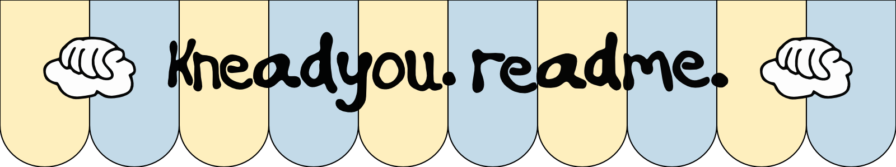
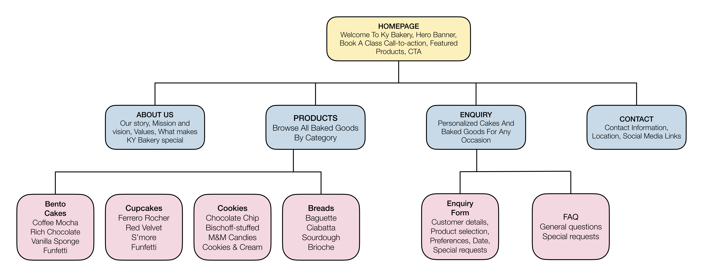

# Welcome to *Knead You* Bakery

## Project Overview

KNEAD YOU (KY) is a contemporary, neighbourhood-focused bakery that unites people with a passion for baking and tasty treats. It was founded in 2022. Its humorous name, which blends the words "knead" and "need you," reflects the idea that food can encourage connections, memories, and a feeling of community. KY encourages people to savour freshly baked goods and experience the joy of baking themselves by fusing classic tastes with modern presentation, inventive recipes, and a straightforward, clean aesthetic.

### Mission
The mission of KNEAD YOU is to unite people with accessible digital content, distinctive baking experiences, classes, recipes, and locally baked products. By fostering creativity, leisure, connection, and individuality while creating a warm, community-driven baking environment, the brand hopes to make baking accessible and rewarding for people of all skill levels.

### Vision
The goal of KNEAD YOU is to establish itself as a reputable and well-known neighbourhood bakery that encourages people to bake, interact, and use food to create unforgettable memories. The brand combines high-quality products with a lively, amicable outlook and an active online and offline community in an effort to cater to younger foodies while also being welcoming to families and baking aficionados.

## Website Purpose

The purpose of the website is to create an online presence for Knead You
and make it easier for customers to:

- Acquire knowledge about the baking
- Examine the items that are offered
- View details about the product
- Make enquiries
- Locate contact details

## Target Audience

The website is aimed at:

- Bakery customers
- People looking for cakes and baked goods
- Local customers in Pretoria
- People discovering Knead You online

## Key Features and Functionality

### Home Page
Introduces Knead You and provides an overview of the bakery.

### About Us
Provides information about the bakery, its story, mission and values.

### Products
Displays the bakery's products, in the following categories:

- Bento Cakes
- Cupcakes
- Cookies
- Breads

### Enquiries
Allows customers to make enquiries about products and orders.

### Contact
Provides the bakery's contact information and location.

## Design Considerations
The website design focuses on:
- A clean and simple layout
- Bakery-inspired visual elements
- Easy navigation
- Clear product presentation
- Accessible contact and enquiry information
- Consistent branding across the website

## Future Improvements
Future versions of the website could include:
- JavaScript functionality
- Online payment options
- Customer reviews
- Product filtering
- Improved enquiry forms

## Timeline and Milestones

03 - 05 August 2026 | Planning & Foundation *(COMPLETED)*

06 - 08 August 2026 | Research & Content Gathering *(COMPLETED)*

10 - 14 August 2026 | HTML Structure *(COMPLETED)*

### Part 1 submission | 14 August 2026

21 - 25 August 2026 | CSS & Visual Design

26 August - 03 September 2026 | Responsive Design

05 - 12 September 2026 | JavaScript & Functionality

15 - 17 September 2026 | SEO, Integration & Testing

18 September 2026 | Parts 2 & 3 Submission

### Part 2 & Part 3 submission | 18 September 2026

## Technical Stack

**HTML5**
— website structure

**CSS3**
— website styling, if you've started/added it

**Git**
— version control

**GitHub**
— repository and hosting/version management

**Visual Studio Code**
— development environment

## Sitemap

## Author
Lethabo Mohlala

WEDE5020 - Part 1

### Copyright
© 2026 Knead You. All rights reserved.

## Image References

### Home page

Xintong. Y. 2019. *Bread in display shelf.* [Online]. Available at: https://unsplash.com/photos/breads-in-display-shelf-go3DT3PpIw4 [Accessed 12 August 2026].

Neuhaus, D. 2025. *Cakes of various sizes and colors sit on stairs.* [Online]. Available at: https://unsplash.com/photos/cakes-of-various-sizes-and-colors-sit-on-stairs-SreQHjuncM0 [Accessed 12 August 2026].

Chikhladze, N. 2024. *A counter topped with lots of different types of pastries.* [Online]. Available at: https://unsplash.com/photos/a-counter-topped-with-lots-of-different-types-of-pastries-tbwY0hGyNX0 [Accessed 12 August 2026].

Heftiba, T. 2022. *A pile of cookies sitting on top of a table.* [Online]. Available at: https://unsplash.com/photos/a-pile-of-cookies-sitting-on-top-of-a-table-eczbkmpM5eI [Accessed 12 August 2026].

Grabowska, K. 2023. *A stack of bagels sitting on top of each other.* [Online]. Available at: https://unsplash.com/photos/a-stack-of-bagels-sitting-on-top-of-each-other-R2mNdxc66M8 [Accessed 12 August 2026].

### About us page

Gladkov, V. 2023. *Bread in a Bakery.* [Online]. Available at: https://www.pexels.com/photo/bread-in-a-bakery-15009979/ [Accessed 12 August 2026].

Heftiba, T. 2024. *A restaurant with tables and chairs and a large window.* [Online]. Available at: https://unsplash.com/photos/a-restaurant-with-tables-and-chairs-and-a-large-window-3I1xdgJMXeQ [Accessed 12 August 2026].

### Products page

Franke, T. 2023. *A table topped with bowls of food and utensils.* [Online]. Available at: https://unsplash.com/photos/a-table-topped-with-bowls-of-food-and-utensils-Wf0fDdBNdlI [Accessed 12 August 2026].

Grabowska, K. 2025. *A slice of rich chocolate cake with white frosting.* [Online]. Available at: https://unsplash.com/photos/a-slice-of-rich-chocolate-cake-with-white-frosting-JMsa9VAGHUY [Accessed 12 August 2026].

Saeng, A. 2023. *A birthday cake with the words happy birthday written on it.* [Online]. Available at: https://unsplash.com/photos/a-birthday-cake-with-the-words-happy-birthday-written-on-it-JXE-ClCYkpw [Accessed 12 August 2026].

Maurer, G. 2025. *A white cake with a slice cut out.*  [Online]. Available at: https://unsplash.com/photos/a-white-cake-with-a-slice-cut-out-EggqnOdgSL0 [Accessed 12 August 2026].

No Revisions, 2021. *Person holding clear glass bottle.* [Online]. Available at: https://unsplash.com/photos/person-holding-clear-glass-bottle-eSLTfkRdW84 [Accessed 12 August 2026].

Siora Photography, 2019. *Cupcake on white surface.* [Online]. Available at: https://unsplash.com/photos/cupcake-on-white-surface-OZfeMV4btPc [Accessed 12 August 2026].

Fotogénicos, A. 2024. *A chocolate cupcake with white frosting and sprinkles.* [Online]. Available at: https://unsplash.com/photos/a-chocolate-cupcake-with-white-frosting-and-sprinkles-Wzo-YDLMzco [Accessed 12 August 2026].

Earle, J. 2023. *A close up of a cupcake on a white surface.* [Online]. Available at: https://unsplash.com/photos/a-close-up-of-a-cupcake-on-a-white-surface-cuoUraQwUds [Accessed 12 August 2026].

Carrie, G. 2026. *A vanilla cupcake with white frosting and colorful sprinkles.*  [Online]. Available at: https://unsplash.com/photos/a-vanilla-cupcake-with-white-frosting-and-colorful-sprinkles-k_lOe4Jw0IQ [Accessed 12 August 2026].

Exclusive Image. 2026. *Stack of delicious chocolate chip cookies.* [Online]. Available at: https://unsplash.com/photos/stack-of-delicious-chocolate-chip-cookies-B-emf3ETUDQ [Accessed 12 August 2026].

Click, S. 2023. *Three cookies and one chocolate chip cookie on a white surface.* [Online]. Available at: https://unsplash.com/photos/three-cookies-and-one-chocolate-chip-cookie-on-a-white-surface-NRAsEAtnlnA [Accessed 12 August 2026].

Stołowicz, J. 2026. *Chocolate chip cookies with colorful candy pieces.* [Online]. Available at: https://unsplash.com/photos/chocolate-chip-cookies-with-colorful-candy-pieces-KD6uvkXDAB4 [Accessed 12 August 2026].

Crop, J. 2023. *A close up of a bunch of bread loaves.* [Online]. Available at: https://unsplash.com/photos/a-close-up-of-a-bunch-of-bread-loaves-6x0BG2emMuU [Accessed 12 August 2026].

Heftiba, T. 2016. *Bread slices beside knife.* [Online]. Available at: https://unsplash.com/photos/bread-slices-beside-knife-KZwp2IIyXmA [Accessed 12 August 2026].

Co, J. 2022. *A loaf of bread sitting on top of a piece of paper.* [Online]. Available at: https://unsplash.com/photos/a-loaf-of-bread-sitting-on-top-of-a-piece-of-paper-z6vpjuwD_FQ [Accessed 12 August 2026].

Sicard, M. 2023. *A pile of powdered sugar cookies sitting on top of a table.* [Online]. Available at: https://unsplash.com/photos/a-pile-of-powdered-sugar-cookies-sitting-on-top-of-a-table-cNfxl-yc_nk [Accessed 12 August 2026].
