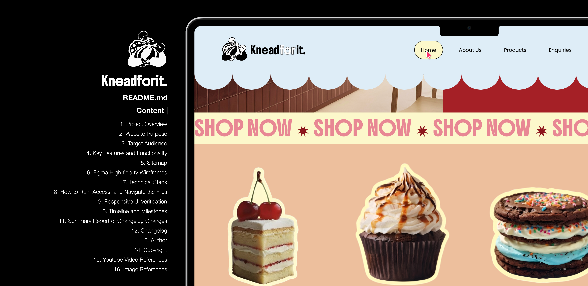
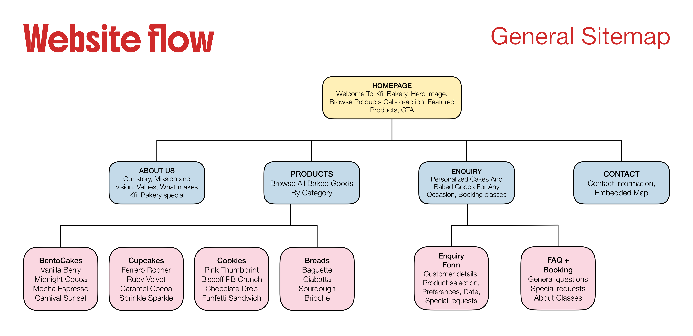
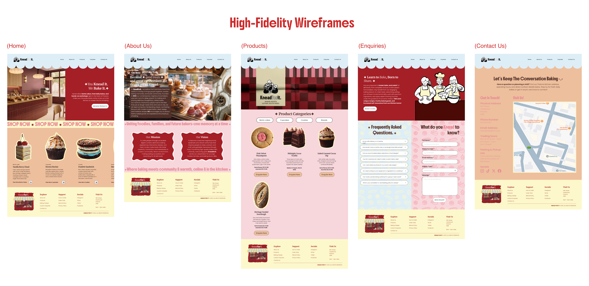
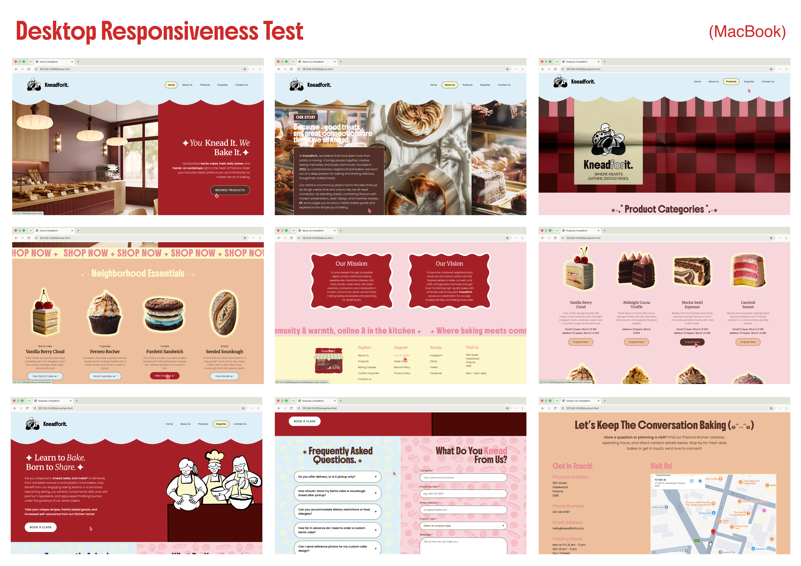
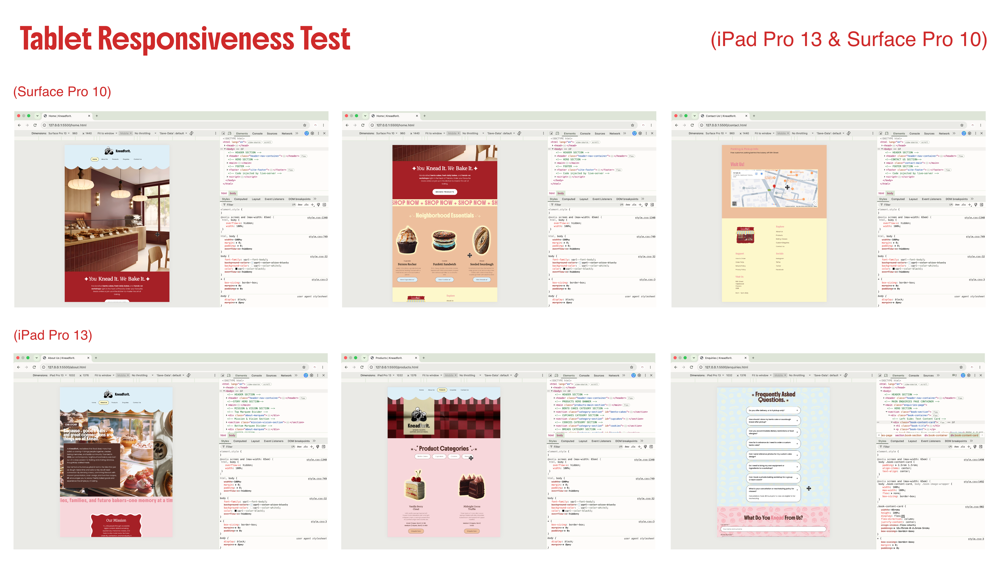
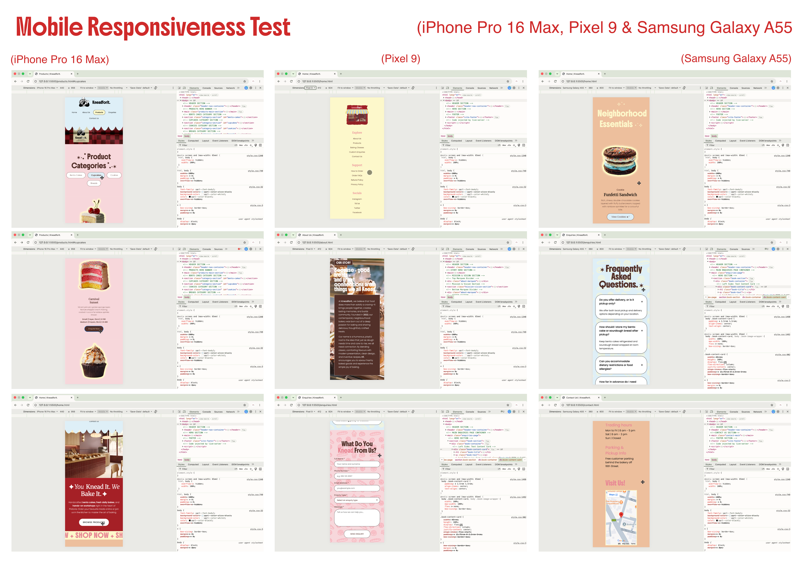

# Welcome to Kneadforit. Bakery (๑ᵔ⤙ᵔ๑)

## 1. Project Overview

**Kneadforit.** (shortened as **Kfi.**) is a contemporary, neighbourhood-focused bakery based in Hazelwood, Pretoria. Established in 2022, the brand combines traditional baking with modern aesthetics, offering freshly baked bento cakes, sourdough breads, cupcakes, cookies, and interactive baking classes.

### Mission
To bring people together through easily available digital material, unique baking experiences, engaging classes, and locally produced, freshly baked goods. We make baking accessible and fulfilling for people of all skill levels by fostering creativity, connection, and originality in a welcoming, community-driven setting.

### Vision
To become a cherished local landmark and a thriving online community that encourages people to interact, bake, and create lifelong memories via food. Kneadforit combines superior baked goods with a warm, inviting atmosphere. acts as a venue for families, bakers, and younger foodies.

## 2. Website Purpose
The website's main goals are to highlight Kneadforit's product line, allow local clients to schedule baking classes and put special order requests, and offer crucial company details (address, operating hours, and communication channels) in an easy-to-use, responsive design.

## 3. Target Audience

- **Local Community & Families**
- **Young Foodies & Trendseekers** 
- **Baking Enthusiasts**

## 4. Key Features and Functionality

### Home Page
- **Continuous Image Slider |** Behind-the-scenes information and bakery displays are displayed on a smooth horizontal backdrop slider.
- **Brand Story Card |** An interactive floating card explaining the origins and significance of Kneadforit.
- **Mission & Vision Wavy Cards |** Personalized cards with text marquee separators at the top and bottom.
 
### About Us
- **Continuous Image Slider |** Behind-the-scenes information and bakery displays are displayed on a smooth horizontal backdrop slider.
- **Brand Story Card |** An interactive floating card explaining the origins and significance of Kneadforit.
- **Mission & Vision Wavy Cards |** Personalized cards with text marquee separators at the top and bottom.

### Products
- **Category Navigation |** Rapid jumps to Bento Cakes, Cupcakes, Cookies, and Breads are made possible using anchor links.
- **Product Grid |** Customizable cards with links to enquiries, pricing tiers, descriptions, and high-resolution photos. 

### Enquiries
- **Interactive FAQ Accordion |** Collapsible accordions made entirely of HTML and CSS with spinning `+`/`x` indication symbols.
- **Custom Enquiry Form |** Custom-styled dropdown menus, input focus states, and inquiry classification (Order Request, Custom Order, Class Booking) are all included in this form.

### Contact
- **Location & Operating Hours |** The shop's address, phone number, email address, and weekly trade hours are presented clearly.
- **Embedded Google Map |** The bakery in Hazelwood, Pretoria, is located on an interactive map iframe.

## 5. Sitemap

## 6. Figma High-fidelity Wireframes

## 7. Technical Stack

### Core Technologies
- **HTML5 |** (`<header>`, `<main>`, `<article>`, `<section>`, `<footer>`, `<picture>`) for structured content and improved screen-readability.
- **CSS3 |** Custom stylesheet (`css/style.css`) using flexbox, CSS grid layouts, CSS custom properties (variables), keyframe animations (`@keyframes horizontalSlide`, `@keyframes marquee-scroll`), and dynamic responsive media queries.

### External Assets & Fonts
- **Google Fonts API |** Imported typography weights for primary, secondary, and accent styles (`Boldonse`, `Merriweather`, and `Poppins`).
- **Embedded Maps |** Interactive Google Maps `<iframe>` integration for physical store location rendering.

### Image & Asset Optimization
- **WebP Image Format |** `.webp` media encoding for optimized site performance and faster load times.
- **HTML5 `<picture>` Elements |** Multi-format image fallback strategy `.webp` graphics with `.png` and `.jpg` fallbacks.
- **Scalable Vector Graphics (SVG) |** Inline vector graphics for decorative UI elements (such as the scalloped banner divider).

### Developer Tools & Version Control
- **Git |** Distributed version control system for tracking incremental changes and page updates.
- **GitHub |** Cloud-based repository hosting and changelog tracking via Conventional Commits.
- **Visual Studio Code |** Primary IDE.

## 8. How to Run, Access, and Navigate the Files

### Running the Website Locally
**8.1. Clone the Repository:**
- git clone [https://github.com/Lethabomohlala/ST10093005_LETHABO_MOHLALA_WEDE5020_POE.git](hhttps://github.com/Lethabomohlala/ST10093005_LETHABO_MOHLALA_WEDE5020_POE.git)

**8.2. Open the Project Directory:**
- cd ST10093005_LETHABO_MOHLALA_WEDE5020_POE

**8.3. Launch in Browser:**
- Double-click home.html directly from your file explorer to launch it in any modern web browser.
- Alternatively, if using VS Code, install the Live Server extension, right-click home.html, and select Open with Live Server.

**8.4. Code Base Architecture & Navigation:**

##### HTML Page Documents (Root Directory):
- home.html | Primary landing page.
- about.html | Brand story.
- products.html | Complete categorized menu.
- enquiry.html | FAQ accordions and custom order/class booking enquiry form.
- contact.html | Physical store location details, trading hours, and embedded Google Maps iframe.

**8.5. Styling System (CSS):**
- css/style.css | Central stylesheet containing design variables (`color palette, typography pairings`), responsive layout grids, keyframe animations (`@keyframes horizontalSlide`, `@keyframes marquee-scroll`), and mobile viewport media queries.

**8.6. Media Assets (images):**
- Stores all graphical assets with PNG/JPG fallbacks.

**8.7. Documentation & Logs:**
- README.md 
- CHANGELOG.md

**8.8. Making Changes and Pushing Updates:**

##### To update code or content via VS Code Terminal:
- Edit target files: Save changes in your HTML or CSS files.- Stage changes | git add .
- Commit with detailed message | git commit -m “short description" -m "- Detailed line 1
Detailed line 2.”
- Push to remote repository | git push origin main

## 9. Responsive UI Verification

### Running tests on Desktop (MacBook)

### Running tests on Tablets (iPad Pro 13 & Surface Pro 10)

### Running tests on Mobile Devices (iPhone Pro 16 Max, Pixel 9 & Samsung Galaxy A55)

## 10. Timeline and Milestones

### Part 1 submission | 14 August 2026

03 - 05 August 2026 | Planning & Foundation *(COMPLETED)*

06 - 08 August 2026 | Research & Content Gathering *(COMPLETED)*

10 - 14 August 2026 | HTML Structure *(COMPLETED)*

### Part 2 submission | 18 September 2026

03 - 04 September 2026 | Rebranding and Visual UI Design *(COMPLETED)*

07 September 2026 | Updating HTML sturctures for all pages *(COMPLETED)*

09 - 12 September 2026 | CSS styling for pages, fixes to HTML structures *(COMPLETED)*

16 - 18 September 2026 | Responsiveness of Website pages + testing *(COMPLETED)*

## 11. Summary Report of Changelog Changes

### Version Release History 

| Version | Date | Core Changes | 
| :--- | :--- | :--- | 
| **v1.0.0** | 2026-08-14 | Initial website repository launch, basic HTML structures, and baseline content files. | 
| **v2.0.0** | 2026-09-18 | Full visual rebrand to Kneadforit., introduction of `style.css`, WebP asset integration, semantic improvements, and multi-device responsive design. |

- **Rebranding |** Renamed from Knead You to Kneadforit. (Kfi.) to establish a distinct, trademark-compliant brand identity.
- **Visual Redesign & CSS Integration |** Replaced static image banners with a centralized stylesheet (css/style.css), implementing responsive flex layouts, web fonts, custom color palettes, and styled components.
- **Enhanced Functionality |** Introduced animated marquee tickers, interactive CSS accordion FAQs, responsive multi-column footers, and embedded Google Maps.
- **Bug Fixes |** Fixed broken anchor links across footers to properly direct custom enquiries to enquiries.html#enquiry-form-section.

## 12. Changelog

All notable changes to the KY Bakery website are documented here.

### [1.0.0] - 2026-08-14

#### Added
- Created the initial website repository.
- Added the homepage design.
- Added the About Us page.
- Added the Products page.
- Added product information and categories.

#### Updated
- Updated the homepage design.
- Updated the About Us page design.
- Updated the Products page design.
- Added further website improvements and refinements.

#### Fixed
- Resolved merge conflicts between the local and remote repository.
- Removed unnecessary `.DS_Store` file.

#### Commits
- Initial Commit
- Delete `.DS_Store`
- Updated homepage design
- Merge remote main and resolve conflicts
- Updated about us page design
- Updated products page design
- Second Commit
- Third Commit

### [2.0.0] - 2026-09-18

#### Added

##### Home:
- Rebranded official store identity across homepage to **Kneadforit.**
- Integrated Google Fonts (`Boldonse`, `Merriweather`, and `Poppins`) and external stylesheet (`css/style.css`).
- Added new visual image assets including bakery interior, storefront illustration, and updated product shots.
- Added responsive `<picture>` tags with a `.webp` fallback.
- Added decorative SVG scalloped header and animated infinite marquee strip.
- Created "Neighborhood Essentials" product scroll grid using `<article>` cards.
- Created `css/style.css` for central site styling, typography, and responsive layout management.
- Customized CSS design variables for brand color scheme and Google Fonts integration.
- Added keyframe animations (`marquee-infinite`) for continuous banner scrolling.
- Added CSS Grid layout for multi-column footer navigation and contact details.
- Added media queries to ensure full mobile and tablet responsiveness across break points.

##### About Us:
- Rebranded official store narrative across About Us page to **Kneadforit.** and **Kfi.**
- Created continuous horizontal background image slider (`story-slider-track`) for story visual showcase.
- Added structured Mission and Vision cards (`wavy-card`) flanked by animated text marquee dividers.
- Expanded `css/style.css` with dedicated About Us page component rules.
- Added `@keyframes horizontalSlide` animation for smooth background story image transitions.
- Added aspect-ratio constrained `.wavy-card` styling for Mission & Vision image frame containers.
- Added media queries scaling wavy card text and padding for mobile viewports under 550px.

##### Products:
- Created category navigation bar with jump links (`#bento-cakes`, `#cupcakes`, `#cookies`, `#breads`).
- Built product card grid catalog showcasing Bento Cakes, Cupcakes, Cookies, and Artisanal Breads.
- Added pricing, sizing variants, and direct inquiry CTA buttons (`Enquire Now`) for all catalog items.
- Expanded `css/style.css` with dedicated Products catalog styling rules.
- Added smooth scrolling behaviors and anchor scroll-margin offsets for category sections.
- Configured 4-column CSS Grid layout (`.product-grid`) for product item cards.
- Added drop-shadow glow effects on product image wrappers and interactive CTA button hover transitions.

##### Enquiries:
- Created interactive baking classes booking hero section (`.book-section`). 
- Implemented accessible HTML5 `
` FAQ accordion section for ordering and classes enquiries. 
- Built custom enquiry form featuring full name, contact, dropdown category selection, and message input fields.
- Expanded `css/style.css` with layout rules for the Enquiries page. 
- Applied seamless tiled background patterns to FAQ and enquiry form split sections. 
- Styled native HTML5 details/summary accordion elements with rotation transitions on expansion. 
- Added custom styling and focus highlights for input fields, textareas, drop-down selects, and submit buttons.

##### Contact:
- Created Contact Us page (`contact.html`) featuring store operating hours, direct contact info, and parking details.
- Embedded Google Maps iframe pointing to the Hazelwood, Pretoria storefront location.
- Added Contact page CSS layout rules in `css/style.css`, featuring a peach background theme, lemon chiffon map borders, and styled detail headers.

#### Changed

##### Home:
- Improved homepage layout for HTML5 compliance and screen readability.
- Updated main hero section text, replacing legacy call-to-action buttons with refined navigation.
- Site footer went from single banner/text block into a multi-column links layout (Explore, Support, Socials, Visit Us).
- Replaced inline component formatting with central CSS classes (`.header-nav-container`, `.hero-content-card`, `.product-card`, `.site-footer`).
- Implemented CSS scroll-snapping and custom drop-shadow hover effects on product images.

##### About Us:
- Improved About Us page structure for improved semantic HTML5 layout.
- Replaced basic static text blocks with styled typography, star icons, and floating card overlays.
- Updated site footer to match the standardized multi-column structure and address details.
- Improved story narrative container positioning using negative margins for seamless header overlay.

##### Products:
- Standardized product card layouts to use central `style.css` grid and typography classes.
- Updated header and footer components to match site-wide brand styling.
- Added responsive media queries scaling product card grid from 4 columns to 2 columns (tablet) and single column (mobile).

##### Enquiries:
- Integrated section anchor (`#enquiry-form-section`) allowing direct jumps from product card CTAs across the site. 
- Updated header active navigation indicator for the Enquiries page.
- Configured responsive breakpoint rules to stack the split FAQ and enquiry sections vertically on mobile screens.

##### Contact:
- Set "Contact Us" navigation link as active in header navigation bar.
- Replaced contact layout with a responsive two-column flexbox design.
- Added responsive CSS media queries to stack contact details and the map vertically on tablet and mobile viewports.

### Fixed
- Updated "Enquire Now" CTA button links on product cards (`products.html`) to correctly navigate to the Enquiries form (`enquiries.html#enquiry-form-section`).
- Fixed footer navigation links for "Custom Enquiries", "Order FAQs", and "How to Order" across all HTML pages to correctly point to `enquiries.html#enquiry-form-section`.

### Commits
- `Updates to home page`
- `Replaced image assets`
- `Add style.css stylesheet for styling and responsiveness`
- `Updates to about page layout`
- `Added About Us page CSS rules to style.css`
- `Updates to products page layout and catalog content`
- `Added Products page layout and catalog grid rules`
- `Updates to enquiries page layout, FAQs, and custom booking form`
- `Added layout, accordion, and form CSS rules for Enquiries page`
- `Updates to Contact page structure, location details, and embedded map`
- `Added layout and responsive styles for contact page`

## 13. Author

**Lethabo Mohlala**

## 14. Copyright

© 2026 Lethabo Mohlala. All rights reserved.

This project and its source code are intended for educational and project purposes. Unauthorized copying, redistribution, or commercial use of this project is not permitted without permission from Lethabo Mohlala.

## 15. Youtube Video References

ALB Dev. 2021. *Hide Scrollbar From Websites in Different Browsers | HTML and CSS.* [video online]. Available at: https://www.youtube.com/watch?v=BVIgE9lZF0w [Accessed 12 September 2026].

Barmajli. 2026. *CSS Neon Glow Effect in 2 Minutes. [video online].* Available at: https://www.youtube.com/watch?v=RA-_Gpvm8yA [Accessed 12 September 2026].

Coding2GO. 2024. *How to create RESPONSIVE Layouts with CSS GRID.* [video online]. Available at: https://www.youtube.com/watch?v=S9OiWe5iBYo [Accessed 12 September 2026].

Coding2GO. 2025. *Build Infinite Carousel Animations in 4 Minutes.* [video online]. Available at: https://www.youtube.com/watch?v=KD1Yo8a_Qis [Accessed 12 September 2026].

CSSnippets. 2024. *Learn All CSS Transition Property for Smooth Animation.* [video online]. Available at: https://www.youtube.com/watch?v=xdap5e3-DwM [Accessed 12 September 2026].

GreatStack. 2022. *How To Make An Accordion Using HTML And CSS | Collapsible Content On Website.* [video online]. Available at: https://www.youtube.com/watch?v=fSkhTd4rpDo [Accessed 12 September 2026].

Powell, K. 2024. *Animate details & summary with a few lines of CSS.* [video online]. Available at: https://www.youtube.com/watch?v=Vzj3jSUbMtI [Accessed 12 September 2026].

Powell, K. 2025. *A deceptively complex form / HTML & CSS / Frontend Mentor.* [video online]. Available at: https://www.youtube.com/watch?v=jJgNgNNHqjk [Accessed 12 September 2026].

Nova Designs. 2024. *Master Responsive CSS Media Queries in easy way.* [video online]. Available at: https://www.youtube.com/watch?v=n9yI6fjkrfE [Accessed 12 September 2026].

Pastor Canayo. 2023. *RESPONSIVE FOOTER WITH HTML AND CSS GRIDS.* [video online]. Available at: https://www.youtube.com/watch?v=cdc3Iczrk-k [Accessed 12 September 2026].

Slaying The Dragon. 2023. *Learn CSS Variables In 7 Minutes.* [video online]. Available at: https://www.youtube.com/watch?v=5wLrz_zUwoU [Accessed 12 September 2026].

Web Bae. 2022. *You Can't Find a Better Infinite Marquee.* [video online]. Available at: https://www.youtube.com/watch?v=ZMCNin2VjxU [Accessed 12 September 2026].

## 16. Image References

### Home page

Amino. 2026. *Artisan bread display.* [Online]. Available at: https://www.lummi.ai/photo/artisan-bread-display-xqg1b [Accessed 14 September 2026].

Amino. 2026. *Colorful cookie dessert.* [Online]. Available at: https://www.lummi.ai/photo/colorful-cookie-dessert-nfhto [Accessed 14 September 2026].

Amino. 2026. *Decadent chocolate cupcake.* [Online]. Available at: https://www.lummi.ai/photo/decadent-chocolate-cupcake-nammx [Accessed 14 September 2026].

Amino. 2026. *Layered vanilla cake.* [Online]. Available at: https://www.lummi.ai/photo/layered-vanilla-cake-de2eu [Accessed 14 September 2026].

### About us page

Stanley, P. 2026. *Decadent Delights - Freshly Arranged Pastries Showcase.* [Online]. Available at: https://www.lummi.ai/photo/artisanal-hipster-donut-shop-canon-ae-1-with-canon-fd-5137a5-4rIl- [Accessed 14 September 2026].

Stanley, P. 2026. *Sunlit Patisserie Elegance* [Online]. Available at: https://www.lummi.ai/photo/artisanal-hipster-donut-shop-canon-ae-1-with-canon-fd-57b52a-lIONw [Accessed 14 September 2026].

Sofia. 2026. *Artistic Assortment of Baked Goods.* [Online]. Available at: https://www.lummi.ai/photo/artistic-assortment-of-baked-goods-xitvi [Accessed 14 September 2026].

### Products page

**Bento Cakes**

Amino. 2026. *Decadent chocolate cake.* [Online]. Available at: https://www.lummi.ai/photo/decadent-chocolate-cake-5b1zo [Accessed 14 September 2026].

Amino. 2026. *Layered vanilla cake.* [Online]. Available at: https://www.lummi.ai/photo/layered-vanilla-cake-mccw [Accessed 14 September 2026].

Clemara Studio. 2026. *Marble cake display.* [Online]. Available at: https://www.lummi.ai/photo/marble-cake-display-18h5w [Accessed 14 September 2026].

SHIHO. 2026. *Vibrant layered cake.* [Online]. Available at: https://www.lummi.ai/photo/vibrant-layered-cake-5smgu [Accessed 14 September 2026].

**Cupcakes**

Amino. 2026. *Decadent chocolate cupcake.* [Online]. Available at: https://www.lummi.ai/photo/decadent-chocolate-cupcake-nammx [Accessed 14 September 2026].

Amino. 2026. *Decadent chocolate cupcake.* [Online]. Available at: https://www.lummi.ai/photo/decadent-chocolate-cupcake-pojmc [Accessed 14 September 2026].

Amino. 2026. *Pink Frosted Cupcake.* [Online]. Available at: https://www.lummi.ai/photo/pink-frosted-cupcake-gi10u [Accessed 14 September 2026].

Jess Bailey Designs. 2018. *Chocolate cupcake with white and red toppings.* [Online]. Available at: https://www.pexels.com/photo/chocolate-cupcake-with-white-and-red-toppings-913136/ [Accessed 14 September 2026].

**Cookies**

Amino. 2026. *Chocolate Chip Cookies.* [Online]. Available at: https://www.lummi.ai/photo/chocolate-chip-cookies-coysx [Accessed 14 September 2026].

Amino. 2026. *Colorful Cookie Dessert.* [Online]. Available at: https://www.lummi.ai/photo/colorful-cookie-dessert-nfhto [Accessed 14 September 2026].

Amino. 2026. *Colorful Thumbprint Cookies.* [Online]. Available at: https://www.lummi.ai/photo/colorful-thumbprint-cookies-nmjkb [Accessed 14 September 2026].

Pedroza, M. 2026. *Crispy Golden Peanut Butter Cookie with Nutty Glaze.* [Online]. Available at: https://www.lummi.ai/photo/product-photo-of-a-peanut-butter-cookie-modern-enetge-305037d5-49c4-4fcf-ac77-bcbc04e7c764-LESv9 [Accessed 14 September 2026].

**Breads**

Amino. 2026. *Artisan bread display.* [Online]. Available at: https://www.lummi.ai/photo/artisan-bread-display-xqg1b [Accessed 14 September 2026].

Grabowska, K. 2023. *A table topped with different types of food.* [Online]. Available at: https://unsplash.com/photos/a-table-topped-with-different-types-of-food-oUKXcZ-JZUs [Accessed 14 September 2026].

Putra, I. 2023. *A loaf of bread sitting on top of a black counter.* [Online]. Available at: https://unsplash.com/photos/a-loaf-of-bread-sitting-on-top-of-a-black-counter-dY8F7ZlZvYU [Accessed 14 September 2026].

Sicard, M. 2023. *A pastry with powdered sugar on top of it.* [Online]. Available at: https://unsplash.com/photos/a-pastry-with-powdered-sugar-on-top-of-it-ipf3dRCfnUs [Accessed 14 September 2026].